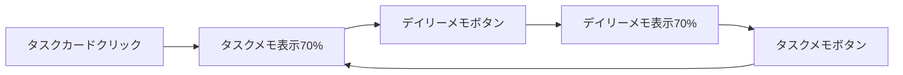

# 引き継ぎ事項 - 2025-07-18 06:12

## From: Planner Agent
## To: Builder
## Current Mode: Phase 2.1 緊急修正フェーズ

## Phase 2.1 実装指示 - 緊急修正とUX改善

### 📊 状況分析結果
プロダクトオーナーによる実使用フィードバックを受け、Phase 1.5で未発見だった重要な問題が明らかになりました。実運用に向けて、これらの修正が最優先で必要です。

### 🎯 Phase 2.1の目的
**期間**: 2-3日  
**目標**: 実用性を阻害している基本機能の修正とUX改善

### ✅ 実装タスク（優先順位順）

#### 🥇 **最優先タスク**（1-2日目）

##### 1. タスク追加フォームの全面改修
**問題**: デザイントーン不統一、レイアウト崩れ、バリデーション不具合

**実装要件**:
- Design Philosophy完全準拠のデザイントーン統一
- Estimated Minutesのバリデーション修正（任意の正の整数を受け入れ）
- レイアウト崩れの修正（特にボタンの視認性）
- 全フィールドの日本語ラベル対応

**TDD要件**:
```typescript
// 🔴 Red Phase - 失敗するテストを先に書く
describe('TaskForm - 改修版', () => {
  test('should accept valid estimated minutes input')
  test('should display proper Japanese labels')
  test('should have unified design tone')
  test('should render buttons properly')
})
```

##### 2. データ永続化システムの実装
**問題**: デイリーメモが保存されない、日付管理がない

**実装要件**:
- デイリーメモの自動保存機能（3秒間の入力停止で保存）
- 日付ごとのデータ分離管理
- LocalStorageスキーマの拡張

**TDD要件**:
```typescript
// 🔴 Red Phase
describe('DailyMemo - データ永続化', () => {
  test('should auto-save memo after 3 seconds of inactivity')
  test('should manage memos by date (YYYY-MM-DD)')
  test('should restore memo for current date on app reload')
})
```

#### 🥈 **高優先度タスク**（2-3日目）

##### 3. タスクメモ・デイリーメモ連携システム
**新機能**: タスクカードクリックでタスクメモ表示、デイリーメモとの連携

**実装要件**:
- タスクカードクリック時のタスクメモ表示
- タスクメモとデイリーメモ間の画面切り替え機能
- タスク情報のデイリーメモへの自動引用機能
- タスクごとのメモ永続化

**設計仕様**:


**TDD要件**:
```typescript
// 🔴 Red Phase
describe('TaskMemo - デイリーメモ連携', () => {
  test('should display task memo when task card is clicked')
  test('should switch between task memo and daily memo')
  test('should auto-quote task info to daily memo')
  test('should persist memo data per task')
})
```

##### 4. 日本語化対応
**問題**: ConfirmDialogが英語、エラーメッセージが英語

**実装要件**:
- ConfirmDialogの完全日本語化
- バリデーションエラーメッセージの日本語化
- UI上の全テキストの日本語化確認

**TDD要件**:
```typescript
// 🔴 Red Phase
describe('Localization - 日本語化', () => {
  test('should display ConfirmDialog in Japanese')
  test('should show Japanese validation messages')
  test('should have Japanese labels throughout UI')
})
```

##### 5. レスポンシブデザイン改善
**問題**: 1200px以下でレイアウト崩れ、モバイル対応不足

**実装要件**:
- 1200px以下でのモバイルレイアウト適用
- タスクリストの適切な幅調整
- モバイル時のアコーディオンUI（タスクメモ・デイリーメモ）

**TDD要件**:
```typescript
// 🔴 Red Phase
describe('Responsive Design - レスポンシブ改善', () => {
  test('should apply mobile layout under 1200px width')
  test('should show accordion UI on mobile')
  test('should handle task list width properly')
})
```

### 🎨 Design Philosophy遵守要件

#### 必須遵守事項
- **統一カラーパレット**: 既存のCSS変数（--primary-text, --background等）を継続使用
- **シンプルさ**: 過度な装飾を避け、機能性重視
- **静寂の美学**: 落ち着いた色調とスムーズなアニメーション（0.3秒）
- **アクセシビリティ**: 適切なフォーカス管理とARIA属性
- **統一アイコン**: 📝（メモ）、🎯（タスク）の一貫使用

### 📊 LocalStorageスキーマ設計

```typescript
// 拡張されるデータ構造
interface AppData {
  tasks: Task[];
  dailyMemos: Record<string, DailyMemo>; // key: YYYY-MM-DD
  taskMemos: Record<string, TaskMemo>;   // key: taskId
}

interface DailyMemo {
  date: string; // YYYY-MM-DD
  content: string;
  lastUpdated: Date;
  taskReferences: TaskReference[];
}

interface TaskMemo {
  taskId: string;
  content: string;
  lastUpdated: Date;
}

interface TaskReference {
  taskId: string;
  taskTitle: string;
  timestamp: Date;
  insights: string;
}
```

### 🔧 技術的制約・注意事項

#### TDD厳守要件
- **全実装にテストファースト**: 🔴Red→🟢Green→🔵Refactor
- **小さなステップ**: 一度に1つの機能のみ実装
- **即座にコミット**: 各フェーズ完了後すぐにコミット

#### コミットルール
- 🔴 `test: add failing test for [feature]`
- 🟢 `feat: implement [feature] to pass test`
- 🔵 `refactor: [description]`

#### 既存システムとの整合性
- **破壊的変更禁止**: 既存の45テストを全て維持
- **CSS統一**: 既存のApp.cssのスタイル基準を継続
- **型安全性**: TypeScript完全対応

### 🎯 完成の定義（DoD）

#### 機能要件
- [ ] タスク追加フォームが適切に動作し、デザインが統一されている
- [ ] デイリーメモが自動保存され、日付ごとに管理されている
- [ ] タスクメモとデイリーメモが連携して動作している
- [ ] 全UIが日本語で表示されている
- [ ] 1200px以下でモバイルレイアウトが適用されている

#### 品質要件
- [ ] 全テスト（45+新規テスト）が通過している
- [ ] プロダクションビルドが成功している
- [ ] TypeScriptエラーがない
- [ ] Design Philosophy要件を満たしている

#### UX要件
- [ ] タスクからデイリーメモへの遷移がスムーズ
- [ ] モバイルでのアコーディオンUIが直感的
- [ ] 自動保存が適切に動作している

### 🚀 実装手順の推奨

1. **Day 1**: タスク追加フォーム修正（TDD）
2. **Day 1-2**: データ永続化システム実装（TDD）
3. **Day 2**: 日本語化対応（TDD）
4. **Day 2-3**: タスクメモ・デイリーメモ連携（TDD）
5. **Day 3**: レスポンシブデザイン改善（TDD）
6. **Day 3**: 統合テスト・最終確認

### 💬 コミュニケーション

実装中に技術的な問題や設計の疑問が生じた場合は、すぐにPlannerに相談してください。特に以下の場合は必須です：

- LocalStorageスキーマの変更が必要な場合
- Design Philosophyとの整合性に疑問がある場合
- UX設計の詳細が不明な場合

## 現在のコンテキスト
- **Phase**: Phase 2.1 緊急修正フェーズ（開始）
- **期間**: 2-3日
- **目標**: 実用性阻害要因の修正とUX基盤整備

---
*プロダクトオーナーフィードバックに基づく緊急修正フェーズです。TDD厳守でスピード感を持って進めましょう。*