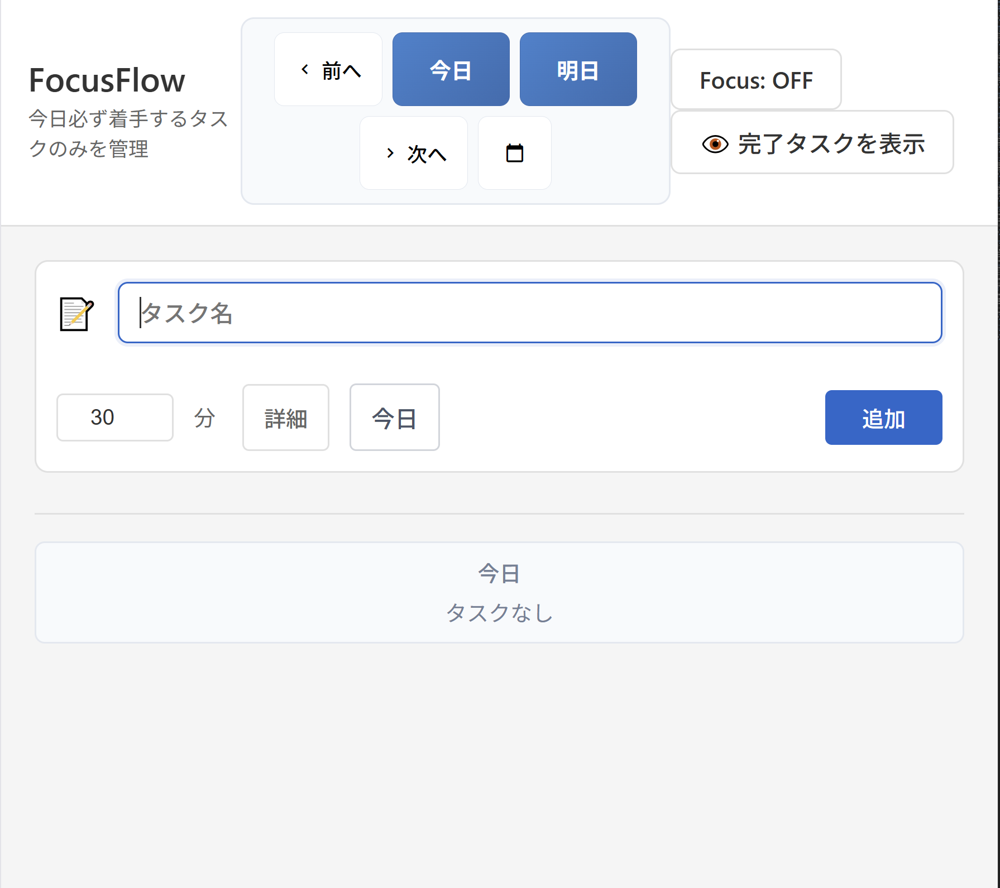

# アイデアノート

## テンプレート
### アイデア名
#### 内容
〇〇
#### 緊急度/重要度
〇/〇
#### progress-management転記
未/済

## アイデア
### 検索機能
#### 内容
過去の検索をしたとき、ただ参照できるのもいいが、「デイリーメモ・タスクメモへの引用」があるといいかもしれない。すべての思考がデイリーメモに集約された状態を作りうる。
#### 緊急度/重要度
中/大
#### progress-management転記
済（T009として登録済み、Phase 2.2d-3で実装予定）

### メモのmarkdown記述支援
#### 内容
メモをマークダウンで取る上で、すべてを手で書くのは非常に大変だ。WYSIWYGエディタが理想だが、それが難しければ、箇条書きやタスク等の入力支援があるだけでもありがたい。
#### 緊急度/重要度
中/中
#### progress-management転記
未（Phase 2.3以降で検討予定）

### トーン＆マナー、デザインシステム
#### 内容
機能の検証が終わりUIの整備が入った段階で、トーン＆マナー、デザインシステムが必要になる。設計内容を整理し、一つ一つ決めていく必要がある
#### 緊急度/重要度
低/大
#### progress-management転記
未（Phase 2.3以降で検討予定、feature-roadmapに記録済み）

### 絵文字からマテリアルデザインアイコンにしたい
#### 内容
絵文字は端末依存があるためUIが保証できない。マテリアルデザインアイコンにしたい。
#### 緊急度/重要度
低/低
#### progress-management転記
未（Phase 2.3以降で検討予定、デザインシステム統一の一部）

### 日付変更コンポーネント　レイアウトバグ
#### 内容
- モバイルレイアウト時、「今日」「前へ」だけが大きくて「次へ」が小さい。「前へ（中くらい）」「今日（大き目）」「次へ（中くらい）「📅（小さめ～中くらい）」」にしたい
- タブレットレイアウト時、文字が潰れる
#### 緊急度/重要度
低/中
#### progress-management転記
済（T005として完了済み、Builder実装済み）

### モバイルレイアウト　日付設定バグ
#### 内容
以下はすべてモバイルレイアウトで確認。
- 7/25にアプリを開いたら7/24が今日であると表示された。androidでnew Date()したとき、JSTではなくUTCを使っていると思われる
- 「今日」選択時、「今日」の文字が消える
#### 緊急度/重要度
大/大
#### progress-management転記
済（T006として緊急登録済み、Builder実装待ち）

### モバイルレイアウト　タスクメモ保存バグ
#### 内容
モバイルレイアウトではタスクメモが保存されない。
- 3秒放置で自動保存
- 「戻る」で保存
をしてほしい。
#### 緊急度/重要度
大/大
#### progress-management転記
済（T007として緊急登録済み、Builder実装待ち）

### playwright E2Eシナリオテスト実装
#### 内容
現在モバイルレイアウトを中心に、一部致命的な機能欠落を確認している。
品質向上のため、
- PC
- タブレット
- モバイル
でそれぞれ、要求単位でシナリオテストを実装する必要がある。
（過去の実装は、ここまでの実装で通るべき1本（×3デバイス）のシナリオテストでよい）
#### 緊急度/重要度
中/大
#### progress-management転記
未（Phase 2.2d完了後に品質強化として検討予定）

### 自動CSSクラスチェックスクリプトが複合セレクタを正しく検出できない
#### 内容
 ❌ 検出できないパターン

  /* 実際には定義済み */
  .nav-btn.nav-large { /* 複合セレクタ */ }
  .nav-btn.nav-medium { }
  .nav-btn.nav-small { }

  スクリプトの誤判定

  # スクリプト結果
  UNDEFINED CLASSES: 4
  nav-large  # ← 実際は.nav-btn.nav-largeで定義済み
  nav-medium # ← 実際は.nav-btn.nav-mediumで定義済み
  nav-small  # ← 実際は.nav-btn.nav-smallで定義済み

  原因分析

  現在のスクリプト:
  grep -h "^\." src -name "*.css" | sed 's/^\.//'
  # → ".nav-btn.nav-large" から "nav-btn.nav-large" を抽出
  # → 単体クラス "nav-large" との照合で失敗

  影響

  - 誤検出率: 複合セレクタ使用時に高頻度で発生
  - 開発効率: 実際は問題ないのに修正作業が発生
  - 品質判定: 正常なコードが品質ゲート不合格と誤判定

  推奨修正

  複合セレクタを考慮した検出ロジックに改善が必要だな。
#### 緊急度/重要度
中/大
#### progress-management転記
済（T008として高優先度登録済み、Builder実装待ち）

### モバイルレイアウト　ブレイクポイント近くのレイアウトで日付コンポーネントが崩れる
#### 内容

特殊な場合に崩れが発生する
#### 緊急度/重要度
低/中
#### progress-management転記
未（特殊ケースのため優先度低、Phase 2.3以降で検討予定）

### タスク登録日　デフォルト設定
#### 内容
タスク登録日のデフォルトは、現在画面表示している日付にしてほしい
#### 緊急度/重要度
低/大
#### progress-management転記
未

### タスクソート順
#### 内容
タスクのソート順は、登録したものを末尾につけるのを基本としたい。
ただしドラッグアンドドロップで調整できるようにしたい。
#### 緊急度/重要度
低/大
#### progress-management転記
未

### タスクアラーム機能
#### 内容
（タスクに開始時刻が設定されている場合のみ）タスク開始時刻になったら通知を出す。フォーカスモードとどう組み合わせるかは要検討。（集中していたが会議が近いので一度頭を切り替える、というユースケースも十分考えられるため）
#### 緊急度/重要度
低/中
#### progress-management転記
未

### タスクアラーム機能
#### 内容
（タスクに開始時刻が設定されている場合のみ）タスク開始時刻になったら通知を出す。フォーカスモードとどう組み合わせるかは要検討。（集中していたが会議が近いので一度頭を切り替える、というユースケースも十分考えられるため）
#### 緊急度/重要度
低/中
#### progress-management転記
未

### タスクアラーム機能
#### 内容
（タスクに開始時刻が設定されている場合のみ）タスク開始時刻になったら通知を出す。フォーカスモードとどう組み合わせるかは要検討。（集中していたが会議が近いので一度頭を切り替える、というユースケースも十分考えられるため）
#### 緊急度/重要度
低/中
#### progress-management転記
未

### デイリーメモの切り替え
#### 内容
デイリーメモは、現在表示中の日のメモを表示するべき。（例：6/1に「明日」ボタンを押したら、6/2のデイリーメモが表示されるべき）
#### 緊急度/重要度
中/大
#### progress-management転記
未

### モバイル・タブレットレイアウト　セーフゾーン対応
#### 内容
画面全体に表示領域が拡大すると、一部操作困難な領域が発生する。この問題を解決するため、デバイスから「セーフエリア」が定義されている（端末によって異なるため環境から情報を取得する形となる。docs/design/mobile-ui-ux-best-practices.md参照）
#### 緊急度/重要度
中/大
#### progress-management転記
未

### デバッグロガーの開発
#### 内容
現在プロダクトコードにデバッグ用のconsole.logが多数残っており、パフォーマンスの劣化が懸念されている。しかし、デバッグ時には即座にログが残る状態は保守の上でメリットがある。そこで、プロダクトコードでは残らずデバッグ時に出力できるデバッグロガーを開発したい。なるべく処理負荷がかからないような仕組みがあるとよい。
#### 緊急度/重要度
低/中
#### progress-management転記
未