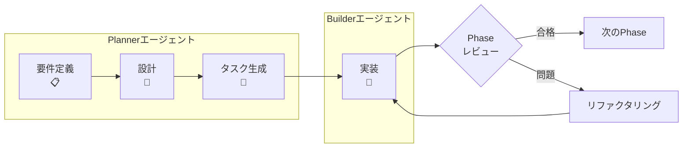

# 🚀 Claude Friends テンプレート

🌐 **日本語** | **[English](README.md)**

> **ひとり開発を、最強のAIチーム開発へ**

## 💡 もし、眠らないAIチームメイトがいたら？

アイデアを整理する**プロジェクトプランナー**と、それを完璧に実装する**コードビルダー**。
それが**Claude Friends** - あなた専用のAI開発チームです。

### ✨ 実際の動作を見てみましょう

```bash
# 朝：AIプランナーが今日の作業を整理
$ /agent:planner
「今日は認証システムに取り組みましょう。3つのフェーズに分けました...」

# 新機能の計画？プランナーが自動で設計モードに切り替え
「ユーザー通知機能を追加したい」
「新機能設計モードに切り替えます。Mermaid図付きの詳細な仕様書を作成しますね...」

# スムーズにAIビルダーへバトンタッチ
$ /agent:builder
「了解！ログインAPIから始めます。計画に従ってJWTを実装しますね...」

# エラーが発生？ビルダーが自動でデバッグモードに切り替え
「TypeError: Cannot read property 'id' of undefined」
「デバッグモードに入ります。このエラーを分析して根本原因を特定しますね...」

# コードの記述、テスト、デバッグ、レビューが自動で進行
```

## 🎯 開発者に愛される理由

### 📉 **90%のコスト削減**
革新的なプロンプトキャッシュで、一日中AIを使っても財布に優しい。

### 🧠 **すべてを記憶するAI**
「何やってたっけ？」はもう過去の話。AIチームが完璧なプロジェクト記憶を維持。

### 🔍 **即座に問題を分析**
AI-Friendly Logger V2（[Vibe Logger](https://github.com/fladdict/vibe-logger)概念採用）が、謎のエラーを数秒で明確な解決策に変換。

### 🎭 **特殊モード付きスマートエージェント**
- **プランナー**: 戦略的思考 + 自動新機能設計モード（Mermaid図付き）
  - 設計同期とドリフト検出
  - ADR（アーキテクチャ意思決定記録）管理
- **ビルダー**: コーディングエキスパート + 自動デバッグモード＆コードレビューモード + TDD厳格遵守
  - 視覚的ステータス追跡付きRed-Green-Refactorサイクル
  - エラーパターン学習と認識
  - テスト自動生成と品質ゲート
- たった4つのコマンドで、無限の可能性！

## 📊 開発フロー概要



### 主なプロセスの特徴:
- **3フェーズ開発**: 要件定義 → 設計 → タスク生成
- **厳格なTDD**: すべてのタスクでRed-Green-Refactorサイクル
- **Phaseレビュー**: 各マイルストーンでの品質ゲート
- **フィードバックループ**: 仕様問題の即時エスカレーション

## 🏃‍♂️ クイックスタート（5分でAI駆動開発を開始）

### 1. テンプレートを取得
```bash
# テンプレートをクローン
git clone https://github.com/[YOUR-USERNAME]/claude-friends-templates.git
cd claude-friends-templates

# プロジェクトにコピー
cp -r . ../my-awesome-project/ && cd ../my-awesome-project/

# セットアップスクリプトで自動設定（新機能！）
./setup.sh
# スクリプトが以下を実行します：
# - プロジェクト名と説明の入力
# - 英語/日本語のデフォルト選択
# - CLAUDE.mdの自動更新
# - gitリポジトリの初期化
# - 適切な権限の設定

# または手動で（お好みの場合）：
# 日本語版を使用する場合（推奨）
# mv README.md README_en.md          # 英語版を一時保存
# mv README_ja.md README.md           # 日本語版をメインに
# mv CLAUDE.md CLAUDE_en.md           # 英語版を一時保存  
# mv CLAUDE_ja.md CLAUDE.md           # 日本語版をメインに
# mv .clauderules .clauderules_en     # 英語版を一時保存
# mv .clauderules_ja .clauderules     # 日本語版をメインに
# テンプレートのgit履歴を削除
# rm -rf .git && git init
```

### 2. AIにプロジェクトを伝える（30秒）
`CLAUDE.md`の最初の2行を編集：
```markdown
# [Project Name]                 ← 置き換え: My Todo App
## プロジェクト概要
[プロジェクトの説明を書く...]    ← 置き換え: シンプルなTodoリストアプリケーション
```

（CLAUDE.mdの残りの部分は気にしないでください - AIがプロジェクトを理解するのに役立つ設定が含まれています）

### 3. AIプランナーと計画を始める
```bash
# Claude Codeで、プランナーエージェントを起動：
/agent:planner

# プランナーが挨拶します：
「こんにちは！プロジェクトの計画を立てましょうか。どんなアプリケーションを作りたいですか？」

# 作りたいものを伝えるだけ：
「タスクを追加・完了・削除できるTodoアプリを作りたい」

# プランナーが手伝います：
「なるほど、タスク管理アプリですね。要件を整理させていただきますね...」
```

### 4. 3フェーズ開発フローに従う

#### 📋 フェーズ1: 要件定義
プランナーが以下を行います：
- 明確化のための質問
- requirements.mdの自動作成
- 成功基準の定義
- リスクと制約の特定

#### 🎨 フェーズ2: 技術設計
要件完了後：
```bash
/agent:planner
「要件が完成しました。技術設計を作成しましょう。」
```
プランナーが以下を行います：
- Mermaidでアーキテクチャ図作成
- コンポーネントとインターフェース設計
- データモデル定義
- 技術的決定の文書化

#### 🔨 フェーズ3: タスク生成と実装
設計完了後：
```bash
/agent:planner
「設計が完了しました。TDDでの実装タスクを生成してください。」
```
プランナーが以下を行います：
- 作業をフェーズに分解（MVP → Advanced）
- Red-Green-Refactorサイクルでタスク作成
- 要件/設計へのトレーサビリティ確保
- レビューチェックポイント追加

### 5. TDDで実装開始
```bash
# 計画が完了したら、ビルダーに切り替え：
/agent:builder

# ビルダーが実装を開始：
「よし、要件を確認したぜ。最初のタスクから始めるか！」
```

### できました！ 🎉
AIチームがあなたのために働いています。プランナーがすべてを整理し、ビルダーがTDDベストプラクティスで実装しています。

### 何か違うものが必要？
- **もっとシンプルに？** プランナーに伝える：「できるだけシンプルにして」
- **機能を追加したい？** プランナーに伝える：「ユーザー認証も追加したい」
- **違うアプローチ？** プランナーに伝える：「別のアーキテクチャを使うべき？」
- **何が必要かわからない？** プランナーに聞く：「何がおすすめ？」

AIエージェントがお手伝いします - 会話するだけです！

### 次のステップ
- 自然に会話を続ける - エージェントは文脈を理解します
- 脱線したら `/project:focus` を使う
- 簡単な振り返りには `/project:daily` を使う
- 準備ができたら[完全ガイド](.claude/claude-friends-guide_ja.md)を読む

> 💡 **日本語環境での使用について**: このテンプレートには英語版（デフォルト）と日本語版（_jaサフィックス）のファイルが含まれています。日本語で開発する場合は、上記のように日本語版ファイルをメインファイルに置き換えることをお勧めします。`.clauderules`ファイルも同様に日本語版を使用できます。

## 🎪 お好みのテンプレートを選択

### 🌟 **Claude Friends マルチエージェントシステム** *(利用可能！)*
計画と実装の両方が必要な複雑なプロジェクトに最適。
- **特殊モード付きスマートAIエージェント**：
  - プランナー: 計画立案 + 新機能設計（Mermaid図付き）
  - ビルダー: コーディング + デバッグモード + コードレビュー
- **たった4つのコマンド**: `/agent:planner`、`/agent:builder`、`/project:focus`、`/project:daily`
- **自動モード切り替え**: エージェントが現在のニーズに適応
- **インテリジェントな引き継ぎ**: モード推奨付きのスムーズな移行

**[→ 詳細を見る](README_TEMPLATE_ja.md#claude-friends)** | **[→ 使い方ガイド](.claude/claude-friends-guide_ja.md)**

### 📦 **クラシックMemory Bankテンプレート** *(現在利用可能)*
AI駆動開発の基盤。
- 階層的な知識管理
- キャッシュ最適化で90%のコスト削減（Anthropicのプロンプトキャッシュ技術に基づく）
- すぐに使用可能

**[→ 完全ドキュメント](README_TEMPLATE_ja.md)**

## 🎯 実際の開発課題に対応

### このテンプレートができること：
- **より良い計画**: AIプランナーがMermaid図付きの詳細な仕様書を自動作成
- **より速いコーディング**: AIビルダーがTDD必須でテストファースト実装を実現
- **即座にデバッグ**: ビルダーのデバッグモードがエラーを分析し根本原因を自動発見
- **自動レビュー**: ビルダーのコードレビューモードが手動作業なしで品質を確保
- **すべてを記憶**: Memory Bankと引き継ぎシステムが完璧なプロジェクトコンテキストを維持

## 🚀 強化機能 (新機能!)

### 🔴🟢✅ テスト駆動開発（TDD）統合
- **厳格なTDDワークフロー**: タスクステータス追跡付きRed-Green-Refactorサイクル
- **視覚的ステータスインジケーター**: 
  - 🔴 未実装（Redフェーズ）
  - 🟢 最小実装完了（Greenフェーズ）  
  - ✅ リファクタリング完了（Refactorフェーズ）
  - ⚠️ ブロック中（3回失敗後）
- **TDDコマンド**: `/tdd:start`でサイクル開始、`/tdd:status`で進捗確認
- **テスト自動生成**: 高速テストのためのテンプレートとモックサポート

### 🎯 強化された設計同期
- **設計ファースト開発**: すべての実装が設計仕様と一致
- **双方向同期**: 設計 ↔ 実装のフィードバックループ
- **設計ドリフト検出**: 設計とコードの乖離を自動チェック
- **ADRシステム**: 設計選択を追跡するアーキテクチャ意思決定記録

### 🔍 AI駆動エラーパターンライブラリ
- **スマートエラー認識**: 過去のデバッグセッションから学習
- **パターンマッチング**: 履歴から類似エラーを即座に特定
- **根本原因分析**: AIが原因と解決策を提案
- **検索可能なデバッグ履歴**: 過去の解決策に素早くアクセス

### 🧪 統合テストフレームワーク
- **テストテンプレート**: 一般的なテストシナリオ用の事前構築テンプレート
- **モック生成**: 依存関係の自動モック作成
- **カバレッジ追跡**: リアルタイムのテストカバレッジ監視
- **品質ゲート**: 80%以上のカバレッジ、複雑度制限を強制

### ⚡ 最適化されたエージェント調整
- **スマートハンドオフ**: 効率的なエージェント切り替えのためのコンテキスト圧縮
- **並列タスク分析**: 同時実行可能なタスクを特定
- **共有Memory Bank**: エージェント間の同期された知識
- **パフォーマンス監視**: エージェント効率とボトルネックの追跡

## 🛠 含まれるもの

```
あなたのAI駆動ワークスペース：
├── 🧠 Memory Bank/          # プロジェクトの完璧な記憶
├── 🤖 AIエージェント/       # 疲れ知らずのチームメイト
├── 🛡️ セキュリティ/         # 自動安全チェック
├── 📊 AIロガー/            # 超強力デバッグ
└── 🎯 カスタムコマンド/      # 生産性ショートカット
```

## 📚 本当に役立つドキュメント

- **[クイックスタートガイド](README_TEMPLATE_ja.md)** - 明確でステップバイステップの手順
- **[Claude Friends 使い方ガイド](.claude/claude-friends-guide_ja.md)** - AIエージェントシステムをマスター
- **[マイグレーションガイド](MIGRATION_GUIDE_ja.md)** - 既存プロジェクトをスムーズにアップグレード
- **[ベストプラクティス](BEST_PRACTICES_ja.md)** - 実証済みの開発パターンを学ぶ
- **[アーキテクチャ概要](ARCHITECTURE_ja.md)** - システム設計を理解
- **[TDDガイド](.claude/builder/tdd-cycle.md)** - テスト駆動開発をマスター
- **[設計同期ガイド](.claude/shared/design-sync.md)** - 設計とコードを一致させる
- **[タスク生成ガイド](.claude/shared/templates/tasks/task-generation-intro.md)** - 要件と設計からタスクを生成
- **[TDD厳密適用ガイド](.claude/shared/templates/tasks/tdd-strict-guide.md)** - t-wada式TDDの実践
- **[Phaseレビューガイド](.claude/shared/templates/tasks/phase-review-template.md)** - 品質ゲートの実施
- **[仕様フィードバック](.claude/shared/templates/tasks/specification-feedback-process.md)** - 仕様問題の迅速な解決

## 🤝 コミュニティに参加

AI駆動開発の未来を探求する開発者コミュニティが成長中。

### 参加方法
- 🌟 GitHubでスターして最新情報を入手
- 🐛 問題報告とフィードバックを共有
- 🔧 改善とアイデアに貢献
- 💬 体験を共有

## 🚀 試してみよう！

Claude Friendsの実際の動作を見てみたいですか？

### 📂 動作するサンプル（新機能！）
**[examples/](examples/)**ディレクトリで完全な動作コードを探索：
- **[Todo App](examples/todo-app/)** - テスト付きの完全実装でワークフローを示す
  - 要件定義 → 設計 → TDD実装
  - 実際のテストファイルとタスク追跡を確認
  - 実際のコードを調べて学習

### 📚 概念プロジェクト
さらなるプロジェクトアイデアは**[サンプルプロジェクト](SAMPLE_PROJECTS_ja.md)**をチェック：
- 📝 マークダウン駆動型タスクマネージャー
- 🌱 デジタルペット生態系
- 🎮 ローグライクゲーム
- ...その他多数！

## 🚦 準備はいいですか？

ただコードを書くのではなく、**オーケストレート**しよう。

**[→ 今すぐAIチームを手に入れる](README_TEMPLATE_ja.md)**

## 📄 ライセンス

このプロジェクトはMITライセンスの下で公開されています。詳細は[LICENSE](LICENSE)ファイルをご覧ください。

---

<p align="center">
  <strong>Claude Friends</strong> - 優秀な開発者は、ハードにではなくスマートに働く
</p>

<p align="center">
  <sub>より大きな夢を持つ開発者のために、❤️を込めて作られました</sub>
</p>