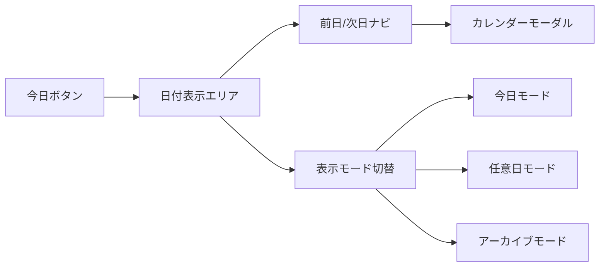
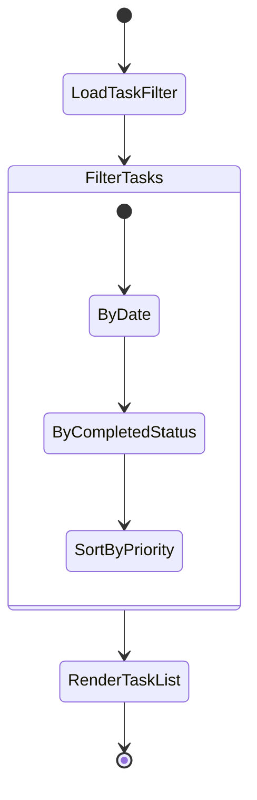

# Phase 2.2a: タスク日付管理システム設計書

---
**フェーズ**: Phase 2.2a  
**作成日**: 2025-07-21  
**担当**: Planner Agent  
**優先度**: 最高  
**期間**: 3-4日  

---

## 🎯 設計目標

### 1. ユーザー体験の転換
**From**: 「すべてのタスクが常に見える」混乱状態  
**To**: 「今日集中すべきタスクだけが見える」集中状態

### 2. 柔軟なタスク計画サポート
- **当日計画**: 今日やるタスクを今日登録
- **前日準備**: 明日やるタスクを今日のうちに登録
- **将来計画**: 任意日のタスクを事前準備

### 3. Today-First UX実現
- デフォルトは常に「今日」表示
- 過去・未来は意図的アクションでのみアクセス
- 「今日に集中する」心理状態をUIでサポート

## 🏗️ アーキテクチャ設計

### データ構造拡張

```typescript
// 既存Task型の拡張
interface Task {
  id: string;
  title: string;
  description: string;
  targetDate: string;        // 🆕 YYYY-MM-DD形式
  createdAt: string;         // 既存：作成日時
  completed: boolean;
  completedAt?: string;      // 🆕 完了日時
  estimatedTime?: number;    // 🆕 見積もり時間（分）
  actualTime?: number;       // 🆕 実際の作業時間（分）
}

// 新規：日付フィルタ管理
interface TaskFilter {
  viewDate: string;          // 表示対象日 (YYYY-MM-DD)
  mode: 'today' | 'date' | 'archive';
  showCompleted: boolean;    // 完了済み表示
  showArchived: boolean;     // アーカイブ表示
}

// 新規：日付統計情報
interface DateStatistics {
  date: string;              // YYYY-MM-DD
  totalTasks: number;        // 総タスク数
  completedTasks: number;    // 完了タスク数
  totalEstimatedTime: number; // 見積もり総時間
  totalActualTime: number;   // 実際の総時間
}
```

### LocalStorageスキーマ拡張

```typescript
// 既存スキーマの拡張
interface AppData {
  tasks: Task[];                           // 全タスクデータ
  dailyMemos: Record<string, DailyMemo>;   // 既存
  taskMemos: Record<string, TaskMemo>;     // 既存
  
  // 🆕 日付関連データ
  taskFilter: TaskFilter;                  // 現在のフィルタ状態
  dateStatistics: Record<string, DateStatistics>; // 日付別統計
}

// LocalStorageキー設計
const STORAGE_KEYS = {
  TASKS: 'focus-flow-tasks',
  TASK_FILTER: 'focus-flow-task-filter',   // 🆕
  DATE_STATS: 'focus-flow-date-statistics' // 🆕
} as const;
```

## 🎨 UI/UX設計

### 1. 日付選択UI設計



**レイアウト仕様**:
```
┌─────────日付ナビゲーション─────────┐
│ [今日] ← 2025年7月21日(月) → [📅] │
│                [📊統計] [🗂️アーカイブ] │
└──────────────────────────────┘
```

### 2. タスク作成フォーム拡張

```typescript
// AddTaskForm拡張仕様
interface AddTaskFormProps {
  defaultDate?: string;      // デフォルト日付
  onTaskCreate: (task: Omit<Task, 'id' | 'createdAt'>) => void;
}

// UI拡張要素
const TaskFormElements = {
  targetDatePicker: DatePicker,    // 🆕 対象日選択
  estimatedTimeInput: NumberInput, // 🆕 見積もり時間
  quickDateButtons: [              // 🆕 クイック選択
    { label: "今日", value: "today" },
    { label: "明日", value: "tomorrow" },
    { label: "来週", value: "next-week" }
  ]
};
```

### 3. タスクリスト表示ロジック



**フィルタリング優先順**:
1. **日付フィルタ**: `task.targetDate === filter.viewDate`
2. **完了状態**: `filter.showCompleted` による制御
3. **ソート**: 作成順→見積もり時間順→タイトル順

### 4. レスポンシブ対応

#### デスクトップ（1200px以上）
```
┌────────────────────────────────────────────────┐
│ [今日] ← 2025年7月21日(月) → [📅] [📊] [🗂️]   │
├─タスクエリア──┬─────メモエリア──────────────────┤
│ 30%         │ 70%                          │
│ ▶ 資料作成    │ [📝 タスクメモ] [📋 デイリーメモ]    │
│   見積:60分   │                              │
│ ▶ 会議準備    │                              │
│   見積:30分   │                              │
└─────────────┴──────────────────────────────────┘
```

#### モバイル（1200px以下）
```
┌─────────────────────┐
│ [今日] 7/21(月) [📅] │
├─────────────────────┤
│ ▶ 資料作成           │
│   見積:60分 実績:-   │
│ ▶ 会議準備           │
│   見積:30分 実績:-   │
│                    │
│ [+ 新規タスク]       │
└─────────────────────┘
```

## 🔧 技術実装仕様

### 1. コンポーネント設計

#### 新規コンポーネント
```typescript
// 1. 日付ナビゲーション
interface DateNavigationProps {
  currentDate: string;
  onDateChange: (date: string) => void;
  onModeChange: (mode: TaskFilter['mode']) => void;
  statistics: DateStatistics;
}

// 2. 日付選択器
interface DatePickerProps {
  selectedDate: string;
  onDateSelect: (date: string) => void;
  availableDates: string[];        // タスクが存在する日付一覧
  showStatistics?: boolean;
}

// 3. タスク統計表示
interface TaskStatisticsProps {
  date: string;
  statistics: DateStatistics;
  compact?: boolean;
}
```

#### 既存コンポーネント拡張
```typescript
// AddTaskForm拡張
interface AddTaskFormProps {
  // 🆕 追加プロパティ
  defaultTargetDate?: string;
  showTimeEstimation?: boolean;
  onTaskCreate: (task: TaskCreateInput) => void;
}

// TaskItem拡張
interface TaskItemProps {
  task: Task;
  // 🆕 日付関連表示制御
  showTargetDate?: boolean;      // 対象日表示
  showTimeInfo?: boolean;        // 時間情報表示
  showDateBadge?: boolean;       // 日付バッジ表示
}
```

### 2. ユーティリティ関数

```typescript
// 日付操作ユーティリティ
export const DateUtils = {
  // 今日の日付取得 (YYYY-MM-DD)
  getToday(): string,
  
  // 日付フォーマット
  formatDate(date: string, format: 'short' | 'long'): string,
  
  // 日付計算
  addDays(date: string, days: number): string,
  subtractDays(date: string, days: number): string,
  
  // 日付比較
  isToday(date: string): boolean,
  isPast(date: string): boolean,
  isFuture(date: string): boolean,
  
  // 日付範囲生成
  getDateRange(start: string, end: string): string[],
  
  // 週/月の境界日取得
  getWeekStart(date: string): string,
  getMonthStart(date: string): string
};

// タスクフィルタリングユーティリティ
export const TaskFilterUtils = {
  // 日付によるフィルタリング
  filterByDate(tasks: Task[], targetDate: string): Task[],
  
  // 完了状態によるフィルタリング
  filterByCompletion(tasks: Task[], showCompleted: boolean): Task[],
  
  // 統計計算
  calculateDateStatistics(tasks: Task[], date: string): DateStatistics,
  
  // ソート
  sortTasks(tasks: Task[], sortBy: 'created' | 'estimated' | 'title'): Task[]
};
```

### 3. カスタムフック

```typescript
// タスクフィルタ管理
interface UseTaskFilterResult {
  filter: TaskFilter;
  updateFilter: (updates: Partial<TaskFilter>) => void;
  filteredTasks: Task[];
  statistics: DateStatistics;
  resetToToday: () => void;
}

export const useTaskFilter = (tasks: Task[]): UseTaskFilterResult;

// 日付ナビゲーション
interface UseDateNavigationResult {
  currentDate: string;
  canGoBack: boolean;
  canGoForward: boolean;
  goToPreviousDay: () => void;
  goToNextDay: () => void;
  goToToday: () => void;
  goToDate: (date: string) => void;
}

export const useDateNavigation = (): UseDateNavigationResult;

// タスク統計
interface UseTaskStatisticsResult {
  getStatisticsForDate: (date: string) => DateStatistics;
  getAvailableDates: () => string[];
  getTotalStatistics: () => DateStatistics;
}

export const useTaskStatistics = (tasks: Task[]): UseTaskStatisticsResult;
```

## 🧪 テスト設計

### 1. ユニットテスト

#### DateUtils テスト
```typescript
describe('DateUtils', () => {
  test('should get today in YYYY-MM-DD format');
  test('should format date correctly in short/long format');
  test('should calculate date ranges correctly');
  test('should identify today/past/future dates correctly');
});
```

#### TaskFilterUtils テスト
```typescript
describe('TaskFilterUtils', () => {
  test('should filter tasks by target date');
  test('should filter tasks by completion status');
  test('should calculate date statistics correctly');
  test('should sort tasks by different criteria');
});
```

#### カスタムフック テスト
```typescript
describe('useTaskFilter', () => {
  test('should filter tasks when date changes');
  test('should update statistics when tasks change');
  test('should persist filter state to localStorage');
  test('should reset to today correctly');
});
```

### 2. 統合テスト

#### タスク作成フロー
```typescript
describe('Task Creation with Date', () => {
  test('should create task for today by default');
  test('should create task for selected date');
  test('should show task in correct date view');
});
```

#### 日付ナビゲーション
```typescript
describe('Date Navigation', () => {
  test('should navigate between dates correctly');
  test('should show correct tasks for each date');
  test('should update statistics when date changes');
});
```

### 3. E2Eテスト

#### シナリオ：明日のタスク準備
```typescript
test('User can prepare tasks for tomorrow', async () => {
  // 1. 今日のビューから開始
  expect(screen.getByText('今日')).toBeInTheDocument();
  
  // 2. 明日に切り替え
  fireEvent.click(screen.getByText('→'));
  expect(screen.getByText('明日')).toBeInTheDocument();
  
  // 3. タスクを追加
  fireEvent.click(screen.getByText('+ 新規タスク'));
  fireEvent.change(screen.getByLabelText('タスク名'), {
    target: { value: '明日の会議準備' }
  });
  fireEvent.click(screen.getByText('追加'));
  
  // 4. 今日に戻ったときにタスクが見えないことを確認
  fireEvent.click(screen.getByText('今日'));
  expect(screen.queryByText('明日の会議準備')).not.toBeInTheDocument();
  
  // 5. 明日に戻ったときにタスクが見えることを確認
  fireEvent.click(screen.getByText('→'));
  expect(screen.getByText('明日の会議準備')).toBeInTheDocument();
});
```

## 📋 実装チェックリスト

### Phase 1: データ構造拡張（1日目）
- [ ] Task型にtargetDate、estimatedTime、actualTime追加
- [ ] TaskFilter型定義
- [ ] DateStatistics型定義
- [ ] LocalStorageスキーマ更新
- [ ] マイグレーション処理実装

### Phase 2: ユーティリティ実装（1日目）
- [ ] DateUtils実装とテスト
- [ ] TaskFilterUtils実装とテスト
- [ ] カスタムフック実装とテスト

### Phase 3: UI コンポーネント実装（2-3日目）
- [ ] DateNavigation コンポーネント
- [ ] DatePicker コンポーネント
- [ ] TaskStatistics コンポーネント
- [ ] AddTaskForm 拡張
- [ ] TaskItem 拡張
- [ ] レスポンシブ対応

### Phase 4: 統合・テスト（3-4日目）
- [ ] App.tsx統合
- [ ] 既存機能との互換性確認
- [ ] E2Eテスト実装
- [ ] パフォーマンステスト

## 🔗 関連設計書

- **前提**: [Phase 2.1b タスクメモ・デイリーメモ連携](/docs/user-guide/memo-integration-guide.md)
- **後続**: [Phase 2.2b 画面制約型フォーカスモード](/docs/design/phase-2-2b-constraint-focus-mode.md)
- **アーキテクチャ**: [Phase 2.2 全体設計](/docs/design/phase-2-2-architecture-overview.md)

## 🎯 完成の定義（DoD）

### 機能要件
- [ ] タスクに対象日を設定できる
- [ ] 日付切り替えで該当タスクのみ表示される
- [ ] 「今日・明日・任意日」の選択が可能
- [ ] 既存のメモ連携機能が継続動作する

### 品質要件
- [ ] 全既存テスト（92テスト）が継続通過
- [ ] 新規テスト30+件が全通過
- [ ] TypeScriptコンパイルエラーなし
- [ ] プロダクションビルド成功

### UX要件
- [ ] 日付切り替えが瞬時（<100ms）
- [ ] レスポンシブ対応完全動作
- [ ] Today-First UXが直感的に理解される

### パフォーマンス要件
- [ ] 100タスクでのフィルタリング<50ms
- [ ] LocalStorage読み書き<20ms
- [ ] 初期表示<500ms

---

**次のステップ**: Builder Agentによる実装開始  
**引き継ぎファイル**: [handover-phase-2-2a.md](.claude/planner/handover.md)

---

*作成者: Planner Agent*  
*作成日: 2025-07-21*  
*バージョン: 1.0*