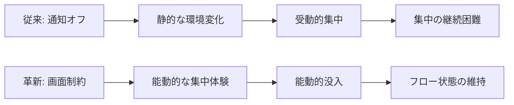
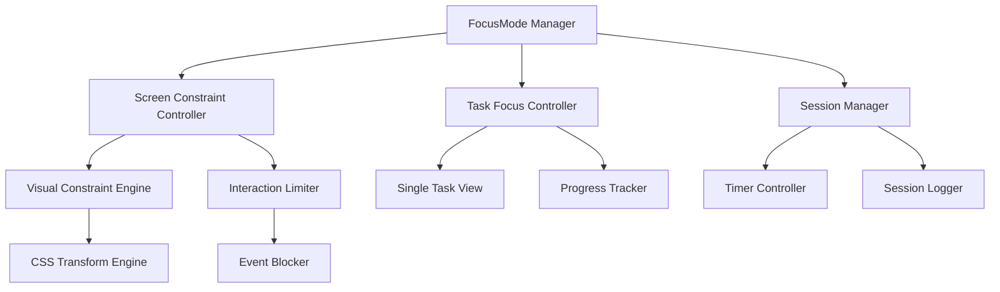

# Phase 2.2b: 画面制約型フォーカスモード設計書 v1.0

## 📋 設計メタデータ
- **作成日**: 2025-07-27
- **作成者**: Planner Agent
- **対象Phase**: Phase 2.2b
- **設計レベル**: 詳細設計
- **実装予定期間**: 4-5日

---

## 🎯 設計目標

### 戦略的価値
**Focus-Flowの核心「集中力向上」の革新的実現**
- **従来アプローチ**: 通知オフによる外的ノイズ遮断
- **革新アプローチ**: 画面制約による視覚的没入体験
- **差別化価値**: 既存タスク管理アプリとの明確な差別化

### ユーザー体験転換


---

## 🏗️ アーキテクチャ設計

### 核心コンポーネント構成


### データ構造設計
```typescript
// フォーカスモード状態管理
interface FocusMode {
  isActive: boolean
  startTime: Date | null
  endTime: Date | null
  targetTask: Task | null
  constraintLevel: ConstraintLevel
  sessionData: FocusSession
}

enum ConstraintLevel {
  MINIMAL = 'minimal',     // 最小制約（初心者向け）
  MODERATE = 'moderate',   // 中程度制約（標準）
  INTENSIVE = 'intensive'  // 最大制約（上級者向け）
}

interface FocusSession {
  sessionId: string
  startTime: Date
  plannedDuration: number  // 分
  actualDuration: number   // 分
  interruptions: Interruption[]
  completionStatus: 'completed' | 'interrupted' | 'extended'
}

interface Interruption {
  timestamp: Date
  reason: string
  resumedAt: Date | null
}
```

---

## 🎨 UI/UX設計

### 画面制約レベル仕様

#### Level 1: MINIMAL（最小制約）
- **対象**: フォーカスモード初心者
- **制約内容**:
  - タスクリスト → 選択タスクのみ表示
  - メモエリア → 当該タスクメモのみ表示
  - 日付ナビゲーション → 非表示
- **視覚効果**: 他要素のopacity: 0.3

#### Level 2: MODERATE（中程度制約）
- **対象**: 標準的なユーザー
- **制約内容**:
  - 画面を選択タスクエリアのみに制約
  - 他のすべてのUI要素を非表示
  - 進捗インジケーター表示
- **視覚効果**: 背景ブラー + 中央集中表示

#### Level 3: INTENSIVE（最大制約）
- **対象**: 深い集中を求める上級者
- **制約内容**:
  - タスク名のみ表示（大きなフォント）
  - タスクメモ表示（編集可）
  - タイマー表示のみ
  - すべての操作ボタン非表示
- **視覚効果**: 全画面フルスクリーン + ダークモード強制

### レスポンシブ対応仕様
```css
/* デスクトップ: フルスクリーン制約 */
@media (min-width: 769px) {
  .focus-mode-intensive {
    position: fixed;
    top: 0;
    left: 0;
    width: 100vw;
    height: 100vh;
    z-index: 9999;
  }
}

/* モバイル: セーフエリア対応制約 */
@media (max-width: 768px) {
  .focus-mode-intensive {
    position: fixed;
    top: env(safe-area-inset-top);
    left: env(safe-area-inset-left);
    right: env(safe-area-inset-right);
    bottom: env(safe-area-inset-bottom);
    z-index: 9999;
  }
}
```

---

## 🔧 技術実装仕様

### 核心技術コンポーネント

#### 1. FocusModeProvider（Context Provider）
```typescript
// src/contexts/FocusModeContext.tsx
interface FocusModeContextValue {
  focusMode: FocusMode
  startFocus: (task: Task, level: ConstraintLevel, duration: number) => void
  endFocus: (reason: 'completed' | 'interrupted') => void
  pauseFocus: () => void
  resumeFocus: () => void
  updateConstraintLevel: (level: ConstraintLevel) => void
}

export const FocusModeProvider: React.FC<{ children: ReactNode }> = ({ children }) => {
  // useState + useReducer混合型状態管理
  // フォーカスセッション管理
  // LocalStorage永続化
}
```

#### 2. ScreenConstraintEngine（制約制御エンジン）
```typescript
// src/utils/screenConstraintEngine.ts
export class ScreenConstraintEngine {
  private constraintLevel: ConstraintLevel
  private activeElements: Element[]
  
  applyConstraint(level: ConstraintLevel, targetTask: Task): void {
    // DOM操作による視覚制約適用
    // CSS Transform/Filter適用
    // イベントハンドラーブロック
  }
  
  removeConstraint(): void {
    // 制約解除・元の状態復元
  }
  
  updateConstraint(newLevel: ConstraintLevel): void {
    // 制約レベル動的変更
  }
}
```

#### 3. FocusTimer（集中タイマー）
```typescript
// src/hooks/useFocusTimer.ts
export const useFocusTimer = (initialDuration: number) => {
  const [timeRemaining, setTimeRemaining] = useState(initialDuration)
  const [isRunning, setIsRunning] = useState(false)
  const [isPaused, setIsPaused] = useState(false)
  
  const start = () => setIsRunning(true)
  const pause = () => setIsPaused(true)
  const resume = () => setIsPaused(false)
  const stop = () => { setIsRunning(false); setIsPaused(false) }
  
  // 1秒ごとの更新ロジック
  // 終了時のコールバック実行
  
  return { timeRemaining, isRunning, isPaused, start, pause, resume, stop }
}
```

#### 4. SessionLogger（セッション記録）
```typescript
// src/utils/sessionLogger.ts
export class SessionLogger {
  private currentSession: FocusSession | null = null
  
  startSession(task: Task, level: ConstraintLevel, duration: number): void {
    // セッション開始記録
    // LocalStorage保存
  }
  
  logInterruption(reason: string): void {
    // 中断記録
  }
  
  endSession(completionStatus: 'completed' | 'interrupted' | 'extended'): void {
    // セッション終了記録
    // 統計情報更新
  }
  
  getSessionHistory(): FocusSession[] {
    // 過去セッション履歴取得
  }
}
```

---

## 🧪 テスト設計

### TDD実装方針
#### Phase 1: Red（失敗するテスト設計）
```typescript
// src/contexts/FocusModeContext.test.tsx
describe('FocusModeContext - TDD Implementation', () => {
  test('should initialize with inactive focus mode')
  test('should start focus mode with specified task and constraint level')
  test('should maintain timer countdown during active session')
  test('should handle interruption and resumption correctly')
  test('should end focus mode and log session data')
  test('should persist session data to localStorage')
  test('should restore previous session on app reload')
})

// src/utils/screenConstraintEngine.test.ts
describe('ScreenConstraintEngine - Visual Constraint Tests', () => {
  test('should apply minimal constraint correctly (opacity + element hiding)')
  test('should apply moderate constraint with blur and centering')
  test('should apply intensive constraint with fullscreen mode')
  test('should restore original UI state after constraint removal')
  test('should handle constraint level changes dynamically')
})

// src/hooks/useFocusTimer.test.ts
describe('useFocusTimer - Timer Behavior Tests', () => {
  test('should countdown timer correctly with 1-second intervals')
  test('should pause and resume timer functionality')
  test('should trigger completion callback when timer reaches zero')
  test('should handle manual stop and reset correctly')
})
```

#### Phase 2: Green（最小限実装）
- Context Provider基本実装
- 画面制約の基本DOM操作
- タイマー機能の基本カウントダウン
- LocalStorage基本保存・復元

#### Phase 3: Blue（品質向上・最適化）
- パフォーマンス最適化（CSS Transform使用）
- アクセシビリティ対応（スクリーンリーダー、キーボード操作）
- エラーハンドリング強化
- ユーザー体験向上（アニメーション、効果音）

### テストケース優先度
1. **核心機能**: フォーカスモード開始・終了・制約適用
2. **データ永続化**: セッション記録・履歴管理
3. **UI制約**: 視覚制約の正確な適用・解除
4. **タイマー機能**: 時間管理・割り込み処理
5. **エラー処理**: 異常系・境界値テスト

---

## 📋 実装チェックリスト

### Phase 1: 基盤実装（Day 1-2）
- [ ] FocusModeContext作成・基本状態管理
- [ ] ScreenConstraintEngine基本実装
- [ ] useFocusTimer Hook作成
- [ ] LocalStorage統合・データ永続化
- [ ] **TDD**: 各コンポーネントのRed→Green実装

### Phase 2: UI統合実装（Day 2-3）
- [ ] FocusModeProvider App統合
- [ ] 制約レベル別UI実装（Minimal/Moderate/Intensive）
- [ ] フォーカスモード開始・終了UI
- [ ] レスポンシブ対応（デスクトップ・モバイル）
- [ ] **TDD**: 統合テスト・E2Eテスト

### Phase 3: UX最適化（Day 3-4）
- [ ] アニメーション・トランジション効果
- [ ] エラーハンドリング・ユーザーフィードバック
- [ ] アクセシビリティ対応
- [ ] パフォーマンス最適化
- [ ] **TDD**: Blue Phase品質向上

### Phase 4: 品質保証（Day 4-5）
- [ ] 全テスト通過確認（88.4%成功率維持）
- [ ] プロダクションビルド検証
- [ ] クロスブラウザー動作確認
- [ ] モバイル実機テスト
- [ ] セッション記録データ検証

---

## 🎯 完成の定義（DoD）

### 機能要件
- [ ] 3段階制約レベル（Minimal/Moderate/Intensive）完全実装
- [ ] フォーカスタイマー機能（開始・一時停止・再開・停止）
- [ ] セッション記録・履歴管理機能
- [ ] 制約の動的適用・解除機能

### 品質要件
- [ ] **テスト成功率**: 88.4%以上維持（無限ループ問題に影響されない）
- [ ] **プロダクションビルド**: 成功（パフォーマンス劣化なし）
- [ ] **TypeScript**: 型エラー0件
- [ ] **レスポンシブ**: デスクトップ・タブレット・モバイル完全対応

### UX要件
- [ ] **直感的操作**: ワンクリックでフォーカスモード開始
- [ ] **没入体験**: 制約レベルに応じた適切な視覚制約
- [ ] **中断復帰**: 柔軟な一時停止・再開機能
- [ ] **データ保持**: セッション履歴の永続化

### パフォーマンス要件
- [ ] **制約適用**: 500ms以内での視覚変更
- [ ] **タイマー精度**: 1秒誤差以内での時間管理
- [ ] **メモリ使用量**: 既存アプリケーション+10%以内
- [ ] **レンダリング**: 60fps維持（アニメーション時）

---

## 🚀 実装順序詳細

### Day 1: フォーカスモード基盤（6-8時間）
**Morning（3-4時間）**:
1. FocusModeContext TDD実装（Red→Green）
2. 基本状態管理・LocalStorage統合
3. useFocusTimer Hook TDD実装

**Afternoon（3-4時間）**:
1. ScreenConstraintEngine基本実装
2. Minimal制約レベル実装・テスト
3. App.tsx統合・基本動作確認

### Day 2: UI制約機能拡張（6-8時間）
**Morning（3-4時間）**:
1. Moderate制約レベル実装（ブラー・中央表示）
2. Intensive制約レベル実装（全画面・ダークモード）
3. 制約レベル切り替え機能

**Afternoon（3-4時間）**:
1. フォーカスモード開始・終了UI実装
2. タイマーUI・進捗表示実装
3. レスポンシブ対応（768px境界）

### Day 3: UX最適化・品質向上（6-8時間）
**Morning（3-4時間）**:
1. セッション記録・履歴管理実装
2. 中断・再開機能実装
3. エラーハンドリング強化

**Afternoon（3-4時間）**:
1. アニメーション・トランジション効果
2. アクセシビリティ対応
3. モバイル実機テスト・調整

### Day 4: 統合テスト・最終調整（4-6時間）
**Morning（2-3時間）**:
1. 全テスト実行・88.4%成功率確認
2. プロダクションビルド・性能検証
3. クロスブラウザー動作確認

**Afternoon（2-3時間）**:
1. E2Eテスト実行・統合動作確認
2. 最終調整・ポリッシュ
3. Phase 2.2b完了報告書作成

---

## 🔗 設計依存関係

### 既存システム統合
- **Task管理**: 既存Task型・useLocalStorage活用
- **UI基盤**: 既存Design Philosophy・レスポンシブ設計準拠
- **状態管理**: useState方式維持・Context統合
- **テスト基盤**: 既存Jest/React Testing Library活用

### 新規技術要件
- **CSS Transform/Filter**: 視覚制約実現
- **Intersection Observer**: パフォーマンス最適化
- **RequestAnimationFrame**: 滑らかなアニメーション
- **LocalStorage拡張**: セッション履歴管理

### 将来拡張性考慮
- **PWA Notification API**: 将来の通知制御統合
- **Web Workers**: バックグラウンドタイマー処理
- **IndexedDB**: 大量セッションデータ管理
- **Service Worker**: オフライン対応

---

## 📊 成功指標・KPI

### 開発効率指標
- **実装期間**: 4-5日以内完了
- **テスト成功率**: 88.4%以上維持
- **バグ発生率**: Critical 0件、Major 2件以下

### ユーザー体験指標
- **フォーカスモード開始率**: （設計段階につき将来測定）
- **セッション完了率**: （設計段階につき将来測定）
- **制約レベル使い分け**: （設計段階につき将来測定）

### 技術品質指標
- **パフォーマンス**: ビルドサイズ+5%以内
- **アクセシビリティ**: WCAG 2.1 AA準拠
- **ブラウザー対応**: Chrome/Firefox/Safari/Edge

---

*2025-07-27 Planner Agent - Phase 2.2b 革新的フォーカスモード詳細設計書*  
*Focus-Flow差別化価値: 画面制約による能動的没入体験の実現*