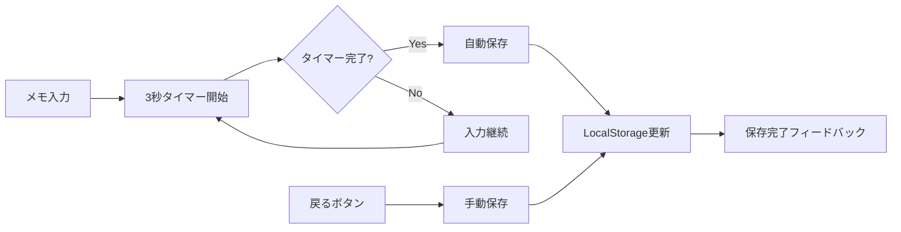

# Phase 2.2d 緊急拡張計画 - データ保護・モバイルUX致命問題解決

## 🎯 設計目標

### 戦略的価値
- **データ保護**: タスクメモ保存機能の確実な動作保証
- **基本信頼性**: 日付表示・選択の正確性確保
- **品質保証**: 自動化ツールの信頼性向上

### ユーザー体験転換
- 「メモが消える不安」→「安心してメモが取れる」
- 「日付が正しくない混乱」→「正確な今日がわかる安心感」
- 「品質ゲート誤判定」→「信頼できる品質指標」

---

## 🚨 緊急度・重要度分析

### 🔥 最高優先度（緊急度：大 × 重要度：大）

#### T006: モバイル日付設定バグ修正
```
- 問題: 7/25開始時に7/24が表示（UTC/JST問題）
- 問題: 「今日」選択時の文字消失
- 影響: 基本機能の破綻、日本市場での信頼性失墜
- 期間: 1日
- 実装者: Builder（TDD必須）
```

#### T007: モバイルタスクメモ保存機能実装
```
- 問題: タスクメモが保存されない（モバイルレイアウト）
- 要求: 3秒自動保存 + 戻るボタン保存
- 影響: データ損失リスク、ユーザー信頼失墜
- 期間: 1-2日
- 実装者: Builder（TDD必須）
```

### ⚡ 高優先度（緊急度：中 × 重要度：大）

#### T008: CSSクラス検証スクリプト改善
```
- 問題: 複合セレクタの誤検出（nav-large等）
- 影響: 品質ゲートの信頼性低下
- 期間: 0.5日
- 実装者: Builder
```

---

## 🏗️ アーキテクチャ設計

### T006: 日付設定バグ修正アーキテクチャ

#### データ構造
```typescript
// 時差対応の日付管理
interface DateManager {
  getCurrentDate(): string; // YYYY-MM-DD (JST)
  formatDateForDisplay(date: string): string;
  isToday(date: string): boolean;
}

// タイムゾーン設定
const TIMEZONE_OFFSET = 9; // JST (UTC+9)
```

#### 核心ロジック
```typescript
// UTC → JST変換
const getJSTDate = (): Date => {
  const now = new Date();
  const utc = now.getTime() + (now.getTimezoneOffset() * 60000);
  return new Date(utc + (TIMEZONE_OFFSET * 3600000));
};

// 今日判定（JST基準）
const isToday = (dateString: string): boolean => {
  const today = getJSTDate().toISOString().split('T')[0];
  return dateString === today;
};
```

### T007: タスクメモ保存アーキテクチャ

#### データフロー


#### 保存機能実装
```typescript
// 自動保存フック
const useAutoSave = (content: string, taskId: string, delay: number = 3000) => {
  const timeoutRef = useRef<NodeJS.Timeout>();
  
  useEffect(() => {
    if (timeoutRef.current) {
      clearTimeout(timeoutRef.current);
    }
    
    timeoutRef.current = setTimeout(() => {
      saveTaskMemo(taskId, content);
    }, delay);
    
    return () => {
      if (timeoutRef.current) {
        clearTimeout(timeoutRef.current);
      }
    };
  }, [content, taskId]);
};
```

---

## 🎨 UI/UX設計

### T006: 日付表示UI改善

#### 今日ボタン状態管理
```tsx
// 状態に応じた視覚表現
const TodayButton = ({ isSelected, onClick }) => (
  <button
    className={`date-nav-btn ${isSelected ? 'nav-today-active' : 'nav-today'}`}
    onClick={onClick}
  >
    {isSelected ? '📍 今日' : '今日'}
  </button>
);
```

### T007: 保存フィードバックUI

#### 保存状態インジケータ
```tsx
// 保存状態の視覚化
const SaveIndicator = ({ saveStatus }: { saveStatus: 'saving' | 'saved' | 'error' }) => {
  const indicators = {
    saving: '💾 保存中...',
    saved: '✅ 保存済み',
    error: '❌ 保存失敗'
  };
  
  return (
    <span className={`save-indicator save-${saveStatus}`}>
      {indicators[saveStatus]}
    </span>
  );
};
```

---

## 🔧 技術実装仕様

### T006: 日付バグ修正実装

#### 1. DateUtilsモジュール作成
```typescript
// src/utils/dateUtils.ts
export const dateUtils = {
  getJSTDate: () => {
    const now = new Date();
    const utc = now.getTime() + (now.getTimezoneOffset() * 60000);
    return new Date(utc + (9 * 3600000)); // JST = UTC+9
  },
  
  formatYMD: (date: Date): string => {
    return date.toISOString().split('T')[0];
  },
  
  isToday: (dateString: string): boolean => {
    const today = dateUtils.formatYMD(dateUtils.getJSTDate());
    return dateString === today;
  }
};
```

#### 2. DateNavigationコンポーネント修正
```typescript
// 既存の new Date() を dateUtils.getJSTDate() に置換
// 今日判定ロジックを dateUtils.isToday() に統一
```

### T007: タスクメモ保存実装

#### 1. useAutoSaveフック作成
```typescript
// src/hooks/useAutoSave.ts
export const useAutoSave = (
  content: string,
  saveFunction: (content: string) => Promise<void>,
  delay: number = 3000
) => {
  const [saveStatus, setSaveStatus] = useState<'idle' | 'saving' | 'saved' | 'error'>('idle');
  const timeoutRef = useRef<NodeJS.Timeout>();
  
  // 3秒遅延保存ロジック
  // 戻るボタン即座保存ロジック
  // エラーハンドリング
};
```

#### 2. TaskMemoコンポーネント統合
```typescript
// モバイル専用保存フック統合
// 戻るボタンイベントハンドリング
// 保存状態UI表示
```

---

## 🧪 テスト設計

### T006: 日付バグ修正テスト

#### ユニットテスト
```typescript
describe('dateUtils', () => {
  test('should return JST date correctly');
  test('should detect today correctly in JST');
  test('should format date as YYYY-MM-DD');
  test('should handle timezone edge cases');
});
```

#### 統合テスト
```typescript
describe('DateNavigation timezone handling', () => {
  test('should display correct date on app start');
  test('should highlight today button correctly');
  test('should maintain today state on selection');
});
```

### T007: タスクメモ保存テスト

#### 自動保存テスト
```typescript
describe('useAutoSave', () => {
  test('should save after 3 seconds of inactivity');
  test('should cancel timer on new input');
  test('should handle save errors gracefully');
  test('should provide correct save status');
});
```

#### モバイル統合テスト
```typescript
describe('TaskMemo mobile save', () => {
  test('should auto-save on mobile layout');
  test('should save on back button press');
  test('should show save feedback to user');
});
```

---

## 📋 実装チェックリスト

### T006: モバイル日付設定バグ修正
- [ ] **Red Phase**: 日付・タイムゾーンテスト作成
  - [ ] JST日付取得テスト
  - [ ] 今日判定テスト  
  - [ ] 表示状態テスト
- [ ] **Green Phase**: 最小限修正実装
  - [ ] dateUtilsモジュール作成
  - [ ] DateNavigationコンポーネント修正
  - [ ] 今日ボタン状態管理修正
- [ ] **Blue Phase**: リファクタリング
  - [ ] 既存日付処理の統一
  - [ ] エラーハンドリング強化
  - [ ] タイムゾーンエッジケース対応

### T007: モバイルタスクメモ保存機能実装
- [ ] **Red Phase**: 保存機能テスト作成
  - [ ] 自動保存テスト（3秒）
  - [ ] 手動保存テスト（戻るボタン）
  - [ ] エラーハンドリングテスト
- [ ] **Green Phase**: 保存機能実装
  - [ ] useAutoSaveフック作成
  - [ ] TaskMemoコンポーネント統合
  - [ ] 保存フィードバックUI実装
- [ ] **Blue Phase**: UX向上
  - [ ] 保存状態インジケータ改善
  - [ ] パフォーマンス最適化
  - [ ] アクセシビリティ対応

### T008: CSSクラス検証スクリプト改善
- [ ] **スクリプト分析**: 現在の誤検出原因特定
- [ ] **ロジック改善**: 複合セレクタ対応実装
- [ ] **テスト実行**: nav-large等の正常検出確認

---

## 🎯 完成の定義（DoD）

### 機能要件
- [ ] モバイルで正確な今日日付が表示される（JST基準）
- [ ] 「今日」ボタンの選択状態が正常に表示される
- [ ] タスクメモが3秒自動保存される（モバイル）
- [ ] 戻るボタンでタスクメモが手動保存される
- [ ] CSSクラス検証が複合セレクタを正常検出する

### 品質要件
- [ ] 全新規テストケースが通過する（15+テスト）
- [ ] 既存テストへの影響がない（266/271テスト維持）
- [ ] プロダクションビルドが成功する
- [ ] モバイル・デスクトップ両方で動作する

### UX要件
- [ ] 日付表示の信頼性が確保される
- [ ] メモ保存の安心感が提供される
- [ ] 保存状態が適切にフィードバックされる

### 品質ゲート要件
- [ ] TypeScript: エラーなし
- [ ] ESLint: エラーなし（1件自動生成ファイル除く）
- [ ] CSSクラス検証: 誤検出なし

---

## 🚀 推奨実装順序

### Day 1: T006 日付バグ緊急修正
1. **Morning**: 日付・タイムゾーンテスト作成
2. **Afternoon**: dateUtilsモジュール実装・統合
3. **Evening**: モバイル実機確認・品質確認

### Day 2: T007 タスクメモ保存実装
1. **Morning**: 自動保存テスト作成・useAutoSave実装
2. **Afternoon**: TaskMemoコンポーネント統合
3. **Evening**: 保存フィードバックUI・実機確認

### Day 3: T008 + 仕上げ
1. **Morning**: CSSクラス検証スクリプト改善
2. **Afternoon**: 全体品質確認・プロダクションビルド
3. **Evening**: T005仕上げ・Phase 2.2d完了宣言

---

## 💡 Phase 2.2b準備事項

### Phase 2.2d完了後の準備作業
1. **革新的フォーカスモード要件定義**
   - 画面制約コンセプトの詳細化
   - ユーザーインタビュー結果反映

2. **技術アーキテクチャ検討**
   - 視覚的制約実装方法
   - 既存UI統合戦略

3. **実装期間見積もり**
   - 4-5日実装計画の詳細化
   - リソース・リスク分析

---

*2025-07-25 Planner Agent - Phase 2.2d 緊急拡張設計書*
*データ保護・モバイルUX致命問題の完全解決を目指す*