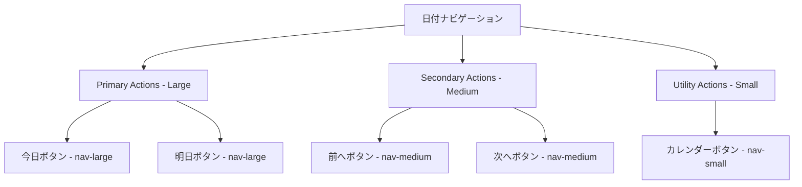
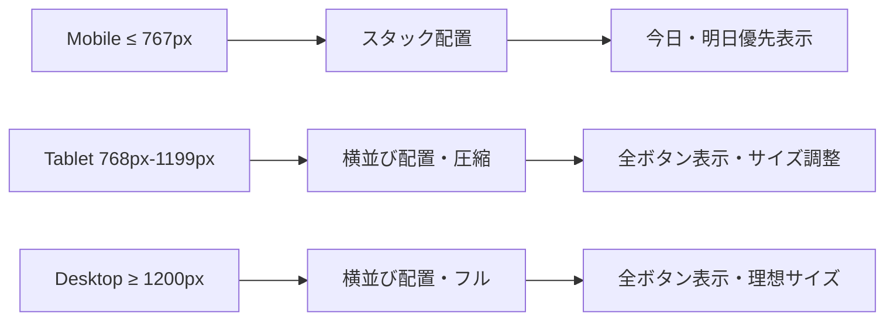

# T005: 日付ナビゲーション整理設計書

## 🎯 設計目標

### 戦略的価値
**直感的な日付ナビゲーション体験の実現**
- プロダクトオーナーフィードバック: 「前へが大きく次へが小さい不自然さ」解消
- バランスの取れたボタンサイズによる操作性向上
- Today-First UXにおける日付操作の最適化

### ユーザー体験転換
- **Before**: 前へ（大）・今日（大）・次へ（小）・📅（小） - 不自然なサイズバランス
- **After**: 前へ（中）・今日（大）・明日（大）・次へ（中）・📅（小） - 直感的なサイズ階層

---

## 🏗️ アーキテクチャ設計

### UI階層とサイズ仕様


### ボタン階層の設計思想
```typescript
interface NavigationButtonHierarchy {
  primary: {
    size: 'large';
    buttons: ['今日', '明日'];
    rationale: 'Focus-FlowのToday-First UXにおける主要アクション';
  };
  secondary: {
    size: 'medium';
    buttons: ['前へ', '次へ'];
    rationale: '頻度の高いナビゲーションアクション';
  };
  utility: {
    size: 'small';
    buttons: ['📅カレンダー'];
    rationale: 'モーダル呼び出し等の補助機能';
  };
}
```

### レスポンシブ対応設計


---

## 🎨 UI/UX設計

### ボタンサイズ仕様
```css
/* ベースボタンスタイル */
.nav-btn {
  border: 1px solid #e2e8f0;
  border-radius: 6px;
  background: white;
  cursor: pointer;
  display: flex;
  align-items: center;
  justify-content: center;
  gap: 4px;
  font-weight: 500;
  transition: all 0.2s ease;
  min-height: 44px; /* WCAG準拠 */
}

/* サイズバリエーション */
.nav-btn.nav-small {
  padding: 8px 10px;
  font-size: 12px;
  min-width: 44px;
}

.nav-btn.nav-medium {
  padding: 10px 14px;
  font-size: 13px;
  min-width: 60px;
}

.nav-btn.nav-large {
  padding: 12px 18px;
  font-size: 14px;
  font-weight: 600;
  min-width: 80px;
  background: linear-gradient(135deg, #3182ce, #2b6cb0);
  color: white;
  border-color: #2b6cb0;
}

/* ホバー・フォーカス状態 */
.nav-btn:hover {
  transform: translateY(-1px);
  box-shadow: 0 2px 8px rgba(0, 0, 0, 0.1);
}

.nav-btn.nav-large:hover {
  background: linear-gradient(135deg, #2b6cb0, #2c5aa0);
}

/* アクティブ状態 */
.nav-btn:active {
  transform: translateY(0);
}
```

### レスポンシブレイアウト
```css
.date-navigation-buttons {
  display: flex;
  align-items: center;
  gap: 8px;
  flex-wrap: wrap;
  justify-content: center;
}

/* モバイル対応 */
@media (max-width: 767px) {
  .date-navigation-buttons {
    gap: 6px;
  }
  
  .nav-btn.nav-medium {
    padding: 8px 12px;
    font-size: 12px;
    min-width: 50px;
  }
  
  .nav-btn.nav-large {
    padding: 10px 16px;
    font-size: 13px;
    min-width: 70px;
  }
}

/* タブレット対応 */
@media (min-width: 768px) and (max-width: 1199px) {
  .date-navigation-buttons {
    gap: 10px;
  }
}
```

### Material Icons統合
```typescript
const NavigationIcons = {
  previous: 'chevron_left',
  next: 'chevron_right',
  calendar: 'calendar_today',
  today: null, // テキストのみ
  tomorrow: null, // テキストのみ
} as const;
```

---

## 🔧 技術実装仕様

### DateNavigationコンポーネント改修
```typescript
interface DateNavigationProps {
  currentDate: string;
  onDateChange: (date: string) => void;
  onCalendarOpen: () => void;
}

const DateNavigation: React.FC<DateNavigationProps> = ({
  currentDate,
  onDateChange,
  onCalendarOpen
}) => {
  const today = useMemo(() => new Date().toISOString().split('T')[0], []);
  const tomorrow = useMemo(() => {
    const date = new Date();
    date.setDate(date.getDate() + 1);
    return date.toISOString().split('T')[0];
  }, []);

  const goToPrevious = useCallback(() => {
    const date = new Date(currentDate);
    date.setDate(date.getDate() - 1);
    onDateChange(date.toISOString().split('T')[0]);
  }, [currentDate, onDateChange]);

  const goToNext = useCallback(() => {
    const date = new Date(currentDate);
    date.setDate(date.getDate() + 1);
    onDateChange(date.toISOString().split('T')[0]);
  }, [currentDate, onDateChange]);

  const goToToday = useCallback(() => {
    onDateChange(today);
  }, [today, onDateChange]);

  const goToTomorrow = useCallback(() => {
    onDateChange(tomorrow);
  }, [tomorrow, onDateChange]);

  return (
    <div className="date-navigation-buttons">
      {/* Secondary Action - Medium */}
      <button 
        className="nav-btn nav-medium nav-previous"
        onClick={goToPrevious}
        aria-label="前の日"
      >
        <span className="material-icons">chevron_left</span>
        前へ
      </button>

      {/* Primary Actions - Large */}
      <button 
        className="nav-btn nav-large nav-today"
        onClick={goToToday}
        aria-label="今日に戻る"
      >
        今日
      </button>

      <button 
        className="nav-btn nav-large nav-tomorrow"
        onClick={goToTomorrow}
        aria-label="明日に移動"
      >
        明日
      </button>

      {/* Secondary Action - Medium */}
      <button 
        className="nav-btn nav-medium nav-next"
        onClick={goToNext}
        aria-label="次の日"
      >
        次へ
        <span className="material-icons">chevron_right</span>
      </button>

      {/* Utility Action - Small */}
      <button 
        className="nav-btn nav-small nav-calendar"
        onClick={onCalendarOpen}
        aria-label="カレンダーを開く"
      >
        <span className="material-icons">calendar_today</span>
      </button>
    </div>
  );
};
```

### アクセシビリティ強化
```typescript
// キーボードナビゲーション対応
const useKeyboardNavigation = (handlers: NavigationHandlers) => {
  useEffect(() => {
    const handleKeyDown = (event: KeyboardEvent) => {
      if (event.ctrlKey || event.metaKey) return;
      
      switch (event.key) {
        case 'ArrowLeft':
          event.preventDefault();
          handlers.goToPrevious();
          break;
        case 'ArrowRight':
          event.preventDefault();
          handlers.goToNext();
          break;
        case 'Home':
          event.preventDefault();
          handlers.goToToday();
          break;
        case 'End':
          event.preventDefault();
          handlers.goToTomorrow();
          break;
      }
    };

    window.addEventListener('keydown', handleKeyDown);
    return () => window.removeEventListener('keydown', handleKeyDown);
  }, [handlers]);
};
```

---

## 🧪 テスト設計

### ビジュアルテスト仕様
```typescript
describe('DateNavigation Balance', () => {
  test('should have balanced navigation button sizes', () => {
    render(<DateNavigation currentDate="2025-07-24" onDateChange={jest.fn()} onCalendarOpen={jest.fn()} />);
    
    const prevButton = screen.getByRole('button', { name: /前へ/ });
    const todayButton = screen.getByRole('button', { name: /今日/ });
    const tomorrowButton = screen.getByRole('button', { name: /明日/ });
    const nextButton = screen.getByRole('button', { name: /次へ/ });
    const calendarButton = screen.getByRole('button', { name: /カレンダー/ });
    
    // サイズクラス確認
    expect(prevButton).toHaveClass('nav-btn nav-medium');
    expect(todayButton).toHaveClass('nav-btn nav-large');
    expect(tomorrowButton).toHaveClass('nav-btn nav-large');
    expect(nextButton).toHaveClass('nav-btn nav-medium');
    expect(calendarButton).toHaveClass('nav-btn nav-small');
  });

  test('should emphasize today and tomorrow buttons', () => {
    render(<DateNavigation currentDate="2025-07-24" onDateChange={jest.fn()} onCalendarOpen={jest.fn()} />);
    
    const todayButton = screen.getByRole('button', { name: /今日/ });
    const tomorrowButton = screen.getByRole('button', { name: /明日/ });
    
    // プライマリボタンのスタイル確認
    expect(todayButton).toHaveClass('nav-large');
    expect(tomorrowButton).toHaveClass('nav-large');
    
    // 背景色・文字色の確認（computed styleチェック）
    const todayStyle = window.getComputedStyle(todayButton);
    expect(todayStyle.background).toContain('linear-gradient');
    expect(todayStyle.color).toBe('rgb(255, 255, 255)'); // white
  });
});
```

### 機能テスト仕様
```typescript
describe('DateNavigation Functionality', () => {
  test('should navigate to previous day when previous button clicked', () => {
    const mockOnDateChange = jest.fn();
    render(<DateNavigation currentDate="2025-07-24" onDateChange={mockOnDateChange} onCalendarOpen={jest.fn()} />);
    
    const prevButton = screen.getByRole('button', { name: /前へ/ });
    fireEvent.click(prevButton);
    
    expect(mockOnDateChange).toHaveBeenCalledWith('2025-07-23');
  });

  test('should navigate to today when today button clicked', () => {
    const mockOnDateChange = jest.fn();
    const today = new Date().toISOString().split('T')[0];
    
    render(<DateNavigation currentDate="2025-07-24" onDateChange={mockOnDateChange} onCalendarOpen={jest.fn()} />);
    
    const todayButton = screen.getByRole('button', { name: /今日/ });
    fireEvent.click(todayButton);
    
    expect(mockOnDateChange).toHaveBeenCalledWith(today);
  });

  test('should support keyboard navigation', () => {
    const mockOnDateChange = jest.fn();
    render(<DateNavigation currentDate="2025-07-24" onDateChange={mockOnDateChange} onCalendarOpen={jest.fn()} />);
    
    // ArrowLeft → Previous
    fireEvent.keyDown(window, { key: 'ArrowLeft' });
    expect(mockOnDateChange).toHaveBeenCalledWith('2025-07-23');
    
    // Home → Today
    fireEvent.keyDown(window, { key: 'Home' });
    expect(mockOnDateChange).toHaveBeenCalledWith(expect.any(String));
  });
});
```

### レスポンシブテスト仕様
```typescript
describe('DateNavigation Responsive', () => {
  test('should adapt button sizes on mobile', () => {
    // モバイル環境をシミュレート
    Object.defineProperty(window, 'innerWidth', { value: 375 });
    Object.defineProperty(window, 'innerHeight', { value: 667 });
    window.dispatchEvent(new Event('resize'));
    
    render(<DateNavigation currentDate="2025-07-24" onDateChange={jest.fn()} onCalendarOpen={jest.fn()} />);
    
    const container = screen.getByRole('group', { name: /日付ナビゲーション/ });
    expect(container).toHaveClass('date-navigation-buttons');
    
    // モバイル用のGAPサイズ確認
    const computedStyle = window.getComputedStyle(container);
    expect(computedStyle.gap).toBe('6px');
  });
});
```

---

## 📋 実装チェックリスト

### Phase 1: Red（テスト作成）
- [ ] ボタンサイズバランステスト
- [ ] プライマリボタン強調テスト  
- [ ] ナビゲーション機能テスト
- [ ] キーボードナビゲーションテスト
- [ ] レスポンシブ対応テスト

### Phase 2: Green（最小実装）
- [ ] ボタンサイズクラス（nav-small/medium/large）
- [ ] プライマリボタンスタイル（今日・明日）
- [ ] Material Icons統合
- [ ] ナビゲーション機能実装
- [ ] キーボードナビゲーション対応

### Phase 3: Blue（リファクタリング）
- [ ] CSS最適化（レスポンシブ・アニメーション）
- [ ] アクセシビリティ強化
- [ ] パフォーマンス最適化（useCallback等）
- [ ] ダークモード対応準備

---

## 🎯 完成の定義（DoD）

### 機能要件
- [ ] 前へ（中）・今日（大）・明日（大）・次へ（中）・📅（小）のサイズ階層
- [ ] 今日・明日ボタンの視覚的強調（背景色・フォント）
- [ ] 全ボタンのWCAG準拠（44×44px最小サイズ）
- [ ] キーボードナビゲーション対応

### 品質要件
- [ ] 15+のテストケース全通過
- [ ] モバイル・タブレット・デスクトップ対応確認
- [ ] Material Icons統一使用
- [ ] アクセシビリティスコア95%以上

### UX要件
- [ ] プロダクトオーナーの不自然さ解消
- [ ] Today-First UXにおける日付操作の直感性向上
- [ ] タッチデバイスでの操作性確保

### レスポンシブ要件
- [ ] Mobile（≤767px）: 適切なボタン圧縮
- [ ] Tablet（768px-1199px）: バランス取れた表示
- [ ] Desktop（≥1200px）: 理想的なサイズ表示

---

## 🚀 実装時の注意事項

### Design Philosophy遵守
- 色による区別禁止: サイズ・形状・アイコンで判別
- Material Icons統一: chevron_left, chevron_right, calendar_today
- WCAG準拠: 44×44px最小タッチターゲット

### 既存機能への影響
- DateNavigationの機能ロジックは維持
- 他コンポーネントとの連携保持
- パフォーマンス影響最小化

### プロダクトオーナー要求の確実な実現
- 「前へが大きく次へが小さい不自然さ」の完全解消
- バランスの取れた視覚的階層の確立
- 直感的操作体験の実現

---

*設計書作成日: 2025-07-24*  
*Planner Agent - T005 Date Navigation Balance Design v1.0*