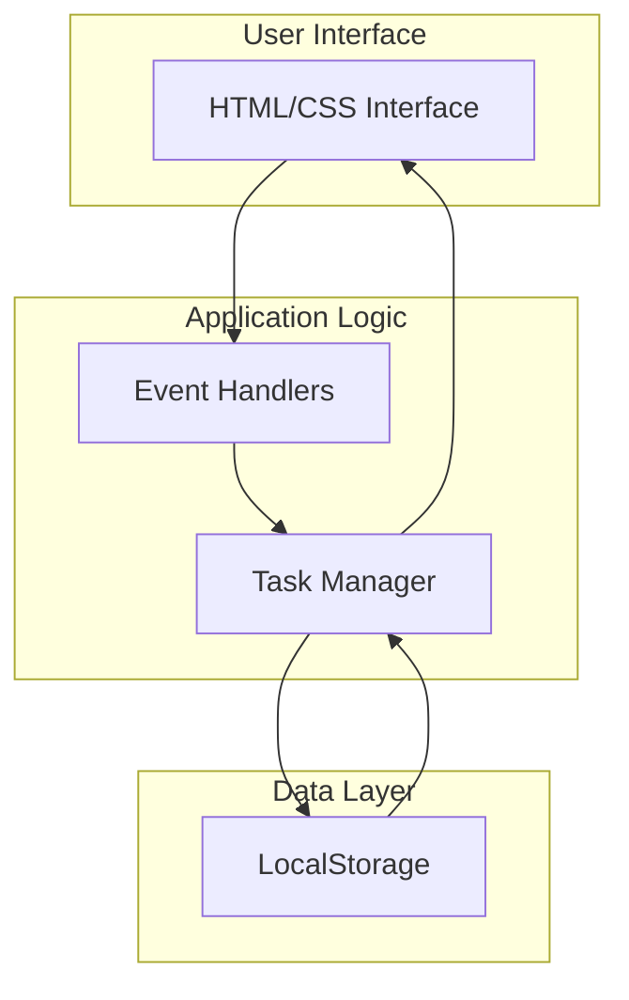
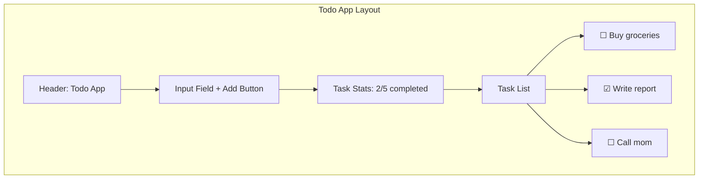
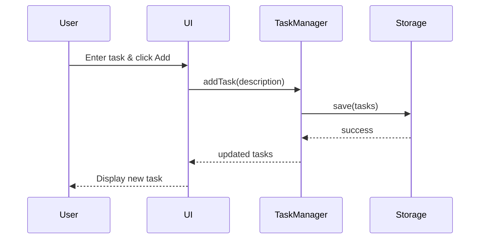

# Todo App Technical Design

## Architecture Overview



## Component Design

### 1. Task Manager (Core Logic)
```javascript
class TaskManager {
    constructor()
    addTask(description)
    completeTask(id)
    deleteTask(id)
    getTasks()
    getStats()
}
```

### 2. Storage Interface
```javascript
class Storage {
    save(tasks)
    load()
    clear()
}
```

### 3. UI Controller
```javascript
class UIController {
    renderTasks(tasks)
    bindEvents()
    showStats(stats)
}
```

## Data Model

### Task Object
```javascript
{
    id: "uuid",
    description: "Task description",
    completed: false,
    createdAt: "2025-07-21T10:00:00Z"
}
```

### Storage Format
```javascript
{
    version: "1.0",
    tasks: [/* array of task objects */]
}
```

## User Interface Design



## Event Flow



## Error Handling

1. **Empty task**: Show validation message
2. **Storage full**: Alert user, suggest cleanup
3. **Corrupted data**: Reset with user confirmation

## Performance Optimizations

1. **Debounce storage writes**: Batch updates
2. **Virtual scrolling**: For large task lists
3. **Lazy rendering**: Only visible tasks

---

## 📋 Next Step: Task Generation

Design complete! Ready to generate TDD tasks.