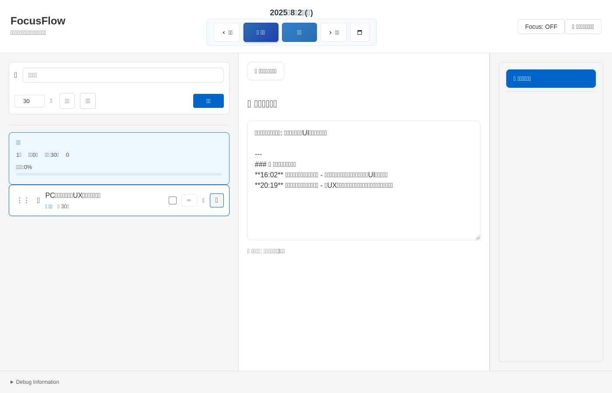
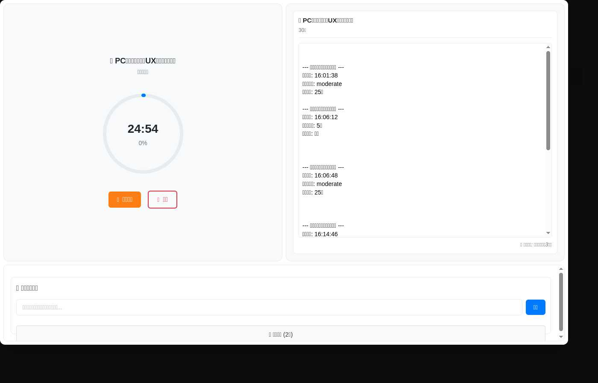
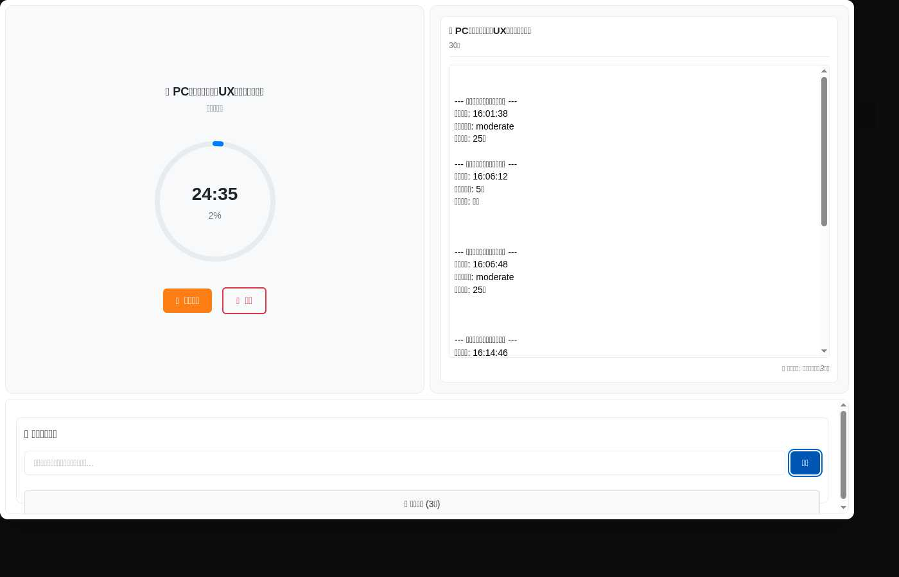
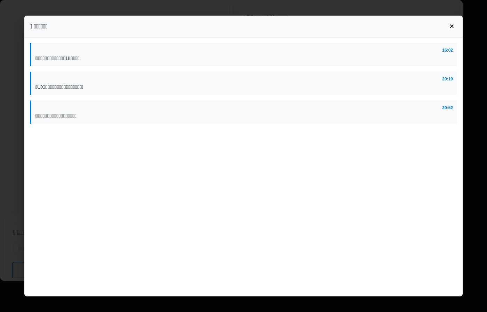

# PC版ひらめきメモ機能 操作手順書

## 概要
フォーカスモード中のひらめき・アイデアを効率的に記録するための機能です。段階的情報開示により、集中を妨げない設計になっています。

## 機能の特徴
- **段階的情報開示**: デフォルトでは入力欄とボタンのみ表示
- **フルスクリーンオーバーレイ**: 必要な時だけ詳細な履歴を確認
- **自動保存**: ひらめきは自動的にLocalStorageに保存
- **デイリーメモ統合**: 集中セッション記録として自動的にデイリーメモにも追記

## 操作手順

### 1. フォーカスモードに入る

**メイン画面からフォーカスモードを開始します**



1. タスク一覧から集中したいタスクを選択
2. 🎯ボタン（フォーカスモード開始）をクリック
3. フォーカスモード画面が表示される

**フォーカスモード画面（ひらめきメモエリア表示）**



### 2. ひらめきメモの基本操作

#### ひらめきを記録する

**デフォルト状態（シンプルな入力画面）**
- 集中を妨げないよう、入力欄と追加ボタンのみが表示されています
- ひらめきが既にある場合は「🔍 一覧表示」ボタンも表示されます

1. 「💡 ひらめきメモ」セクションの入力欄をクリック
2. 集中中のアイデアや気づきを入力
3. 「追加」ボタンをクリック、またはEnterキーを押す
4. 入力フィールドが自動的にクリアされる

**ひらめき追加後の状態**



- ひらめきを追加すると、一覧表示ボタンに件数が表示されます（例：「🔍 一覧表示 (3件)」）

#### 過去のひらめきを確認する

**段階的情報開示 - 必要な時だけ詳細表示**

1. ひらめきが1件以上ある場合、「🔍 一覧表示 (N件)」ボタンが表示される
2. このボタンをクリックするとフルスクリーンオーバーレイが開く

**フルスクリーンオーバーレイ表示**



3. 時刻付きでひらめき履歴が一覧表示される
4. 右上の「✕」ボタンで閉じる

### 3. デイリーメモとの連携
- ひらめきを追加すると、自動的にデイリーメモにも記録される
- デイリーメモの「🎯 集中セッション記録」セクションに時刻付きで追記
- フォーマット例: `**20:19** 集中セッション中のひらめき - 新UX改善のアイデア`

## UI要素の説明

### デフォルト状態
```
💡 ひらめきメモ
┌─────────────────────────────────┐
│ [集中中のひらめき・アイデアを記録...] [追加] │
├─────────────────────────────────┤
│ [🔍 一覧表示 (2件)]                  │
└─────────────────────────────────┘
```

### フルスクリーンオーバーレイ
```
┌─────────────────────────────────────┐
│ 💡 ひらめき履歴                  ✕ │
├─────────────────────────────────────┤
│ 20:19                             │
│ 新UX改善のアイデア                   │
├─────────────────────────────────────┤
│ 16:02                             │
│ 実装が完璧に動作している！             │
├─────────────────────────────────────┤
│ [スクロール可能]                     │
└─────────────────────────────────────┘
```

## データ保存について
- **LocalStorage**: ブラウザのローカルストレージに自動保存
- **データ形式**: JSON形式で日付別に管理
- **保存キー**: `inspiration-memo-YYYY-MM-DD`
- **永続性**: ブラウザデータを削除するまで保持

## トラブルシューティング

### ひらめきが保存されない場合
1. ブラウザのLocalStorageが有効になっているか確認
2. プライベートブラウジングモードの場合、通常モードで試してみる
3. ブラウザの容量制限に達していないか確認

### 一覧表示ボタンが表示されない場合
1. ひらめきが1件以上記録されているか確認
2. ページをリロードして再度試してみる

### フルスクリーンオーバーレイが開かない場合
1. 一覧表示ボタンを正しくクリックしているか確認
2. ブラウザの開発者ツールでJavaScriptエラーがないか確認

## 注意事項
- ひらめきメモはブラウザごと・デバイスごとに独立して保存されます
- データの同期機能は現在実装されていません
- 重要なアイデアは別途バックアップを取ることをお勧めします

---
*作成日: 2025-08-02*  
*対象バージョン: PC版ひらめきメモUX改善実装版*